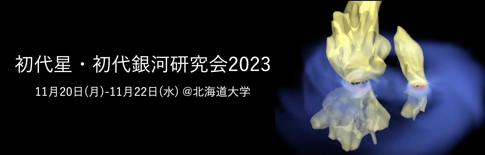

<meta name="google-site-verification" content="jLmQ48dgPU8nEG_idous6vxotcuyBT2oOIztElS4Jgw" />

日程  

 2023年11月20日(月)-2023年11月22日(水)  
  

場所  

 
北海道大学　札幌キャンパス 

クラーク会館　大集会室１((交通アクセス)[https://www.hokudai.ac.jp/bureau/property/clarke/access/])

〒060-0809　札幌市北区北9条西9丁目

  

開催趣旨  

本研究会は、宇宙初期の天体形成・進化に関連した研究の現状を総括し、今後の課題について議論を交わすことによる研究のさらなる発展を目的に、毎年開催しているものです。

研究会の話題は初代星・初代銀河に限らず、

- 巨大ブラックホールの起源とその成長
- 宇宙再電離
- ライマンアルファ輝線天体・ガンマ線バーストなどの高赤方偏移天体
- 重力波源として観測されているブラックホール連星合体
- 現在のハローや矮小銀河中の低金属星

など研究の進展と共に広がっています。

　これら初期宇宙と密接に関連した天体について、理論・観測を問わず議論する研究会と位置付けています。この分野に興味がある・これから研究を始めたいと考えている方々の参加も歓迎いたします。

　奮ってご参加いただけますよう、よろしくお願いします。
  

基調講演者（50音順・敬称略） 
- 石垣 美歩 (国立天文台) 　: 銀河考古学
- 稲吉 恒平 (北京大学)　 　: 巨大ブラックホール形成
- 大向 一行 (東北大学)　 　: 初期宇宙の星形成
- 岡本 崇　 (北海道大学) 　: 銀河形成
- 郡 和範　 (国立天文台)　 : 宇宙論
- 但木 謙一 (北海学園大学) : 遠方銀河観測
- 播金 優一 (東京大学)　　 : 遠方銀河観測
- 矢島 秀伸 (筑波大学)　 　: 初代銀河形成
  

[過去の研究会](http://tpweb2.phys.konan-u.ac.jp/~shodai/)
  

研究会世話人 

杉村 和幸 (北海道大学：LOC), 梅村 雅之 (筑波大学), 大向 一行 (東北大学), 須佐 元 (甲南大学)

千秋 元(高知高専), 鄭 昇明 (MPIA), 冨永 望 (国立天文台), 平野 信吾 (東京大学)

福島 肇 (筑波大学), 細川 隆史(京都大学), 町田 正博 (九州大学), 吉田 直紀 (東京大学)
  

問い合わせ 

福島　肇 (筑波大学)  fukushima_at_ccs.tsukuba.ac.jp
  

INFORMATION 
  

謝辞 

